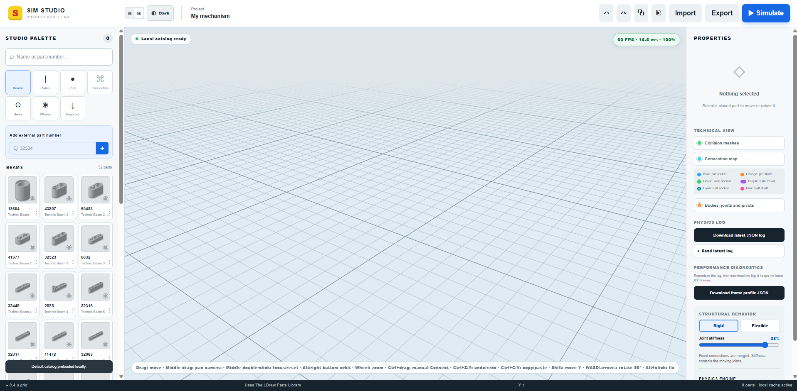

# Sim Studio

Sim Studio is an experimental browser-based 3D editor for building LEGO® Technic-compatible mechanisms and testing them with real-time physics. It combines full LDraw part geometry with connection maps, compound colliders, configurable joints, motors, gravity, friction and collision simulation.

> Sim Studio is an independent, unofficial project. It is not sponsored, endorsed or authorized by the LEGO Group, BrickLink or Studio.

<p align="center">
  
</p>

## Use it online

**[Open Sim Studio in your browser](https://worketeworks.github.io/SimStudio-LEGO-Technic-Physics-Simulator/)** — no download or installation is required.

The GitHub Pages version includes the complete default palette and its locally packaged geometry. Features that require the dynamic external-catalog API may be limited on static hosting.

## Main features

- Offline-first default palette with locally packaged LDraw sources, parsed 3D geometry, renders, connection maps, collider data and metadata.
- Beams, axles, pins, connectors, gears and wheels organized into Studio-like categories.
- Search by part name or part number, plus external LDraw part import with source and requested/resolved-reference metadata.
- Drag parts from the palette into the 3D workspace.
- Move placed parts on X/Z, use `Shift` for constrained movement, and rotate them by any angle.
- Rotate the selected part in 90° steps with `WASD` or the arrow keys.
- Import `.ldr`, `.mpd` and BrickLink Studio `.io` models and export the assembly as `.ldr`.
- Import preview and progress dialog that separates locally cached palette parts from external catalog parts.
- Change a placed part to any supported LDraw color from its properties.
- Light and dark themes, including the 3D environment.
- Spanish and English UI, selected from the flag button in the top bar.
- Orbit, pan, zoom, part-focused camera targeting, below-floor viewing and an effectively infinite adaptive grid.
- Gravity, friction, self-collision, configurable joints, motors and spring-force dragging with a live newton readout.
- Fix or release parts with `Alt + click`.
- Restore the complete build state when the simulation stops.
- Rigid and flexible structural modes with adjustable joint stiffness.
- Runtime axle/socket and gear engagement updates when moving mechanisms connect or separate.
- JSON physics log for the most recent simulation.
- FPS overlay and detailed frame-performance profiling.
- Diagnostic views for compound colliders, connection points, rigid bodies, pivots, groups and physics joints.
- Connection-map and compound-collider editors with JSON import/export for correcting individual parts.
- Resizable properties panel with model provenance, requested reference, resolved LDraw file and download source.

## Offline-first part catalog

Every default-palette variant is stored in the repository:

```text
public/
├── catalog/
│   ├── geometry/       # Pre-parsed Three.js geometry for each part/color variant
│   ├── renders/        # Local palette thumbnails
│   └── manifest.json   # Metadata, connection maps, colliders and asset paths
└── ldraw/              # Original LDraw parts, subparts and primitives
```

The editor loads pre-parsed local geometry first. The original LDraw source tree is retained for attribution, reproducibility and future regeneration. Network access is only required when a user imports an external part that is not included in the default palette.

To rebuild the package after editing `app/palette.ts` or the connection algorithms:

```bash
npm run catalog:precache
```

The generator recursively downloads the required LDraw dependencies, stores the thumbnails, parses each color variant and writes the connection/collider manifest. Review generated connection maps in the editor because automatic detection can still require manual correction for irregular parts.

## Connect system

Connection maps use six visual connector types:

| Color | Connector | Compatible with |
| --- | --- | --- |
| Blue | Round socket | Orange pins and purple axles |
| Orange | Pin shaft | Blue sockets |
| Green | Cross-shaped axle socket | Purple axles |
| Purple | Usable axle path | Green and blue sockets |
| Cyan | Half-width socket | Orange pins at either half-width position |
| Pink | Half-width shaft | Cyan sockets and either half of a blue socket |

Mixed parts can contain sockets and shafts at the same time. Each shaft uses its own local position, orientation and usable length, allowing perpendicular holes on axle pins and pin connectors to participate in auto-connect.

Auto-connect aligns only the connector axes that must coincide and preserves the part's existing rotation around that axis. `Ctrl + drag` starts manual Connect: choose a connection point, drag its guide and release near a highlighted compatible point. The connection-map overlay is temporarily enabled for this operation and returns to its previous visibility state afterward.

Axles may span several rigid groups without colliding with the parts they connect. Connections can be detected, released and recovered during simulation when an axle enters or leaves a compatible socket. This dynamic behavior can be disabled per axle.

### Joint modes

Each connection is configured on the part that owns the orange or purple shaft:

| Connection | Fixed | Rotation | Linear | Rotation + linear | Motor |
| --- | :---: | :---: | :---: | :---: | :---: |
| Orange pin ↔ blue socket | ✓ | ✓ | — | — | ✓ |
| Purple axle ↔ green socket | ✓ | — | ✓ | — | — |
| Purple axle ↔ blue socket | — | ✓ | ✓ | ✓ | ✓ |

Friction pins default to rigid joints. Other multi-connection shafts intelligently keep one anchoring joint while assigning the greatest compatible freedom to their remaining joints. Cross-axle connections default to fixed.

Motor mode creates a driven rotational joint with configurable angular speed, direction and maximum torque.

### Gear coupling

Compatible gears are linked from their tooth counts, pitch radii, axis alignment and centre distance. Motion is transferred in either direction using the calculated ratio. Gear engagement is updated during simulation when height, alignment or distance changes, and a separate gear-contact collider keeps tooth interaction independent from the normal solid collider.

## Physics and colliders

The visible LDraw mesh remains detailed, while Rapier uses lighter compound colliders. The generated collider set is stored in the local catalog instead of being recalculated on every browser session.

- Straight beams use a longitudinal box and cylindrical end caps with a 0.45-stud radial envelope.
- L, T and angled beams use multiple aligned boxes and 0.45-radius cylinders.
- Pins and axles use simplified cylinders.
- Wheels, gears and bushes use cylindrical approximations.
- Irregular parts fall back to adjusted compound boxes/cylinders.

Fixed connections may be merged into rigid physics islands for stable large structures. Non-rigid joints remain the boundaries between those islands. Flexible mode restores per-part bodies and exposes a stiffness control for mechanisms that should bend slightly rather than behave as perfectly rigid assemblies.

During simulation, clicking a point on a part and dragging applies a visible spring force at that exact point. The force label displays newtons and the off-center application point can create torque. Stopping simulation restores all parts, connections and joint settings to their pre-simulation state.

The renderer caps presentation at 60 FPS. Dynamic resolution reduction is reserved for severe sustained drops, while instancing, cached geometry and visibility culling reduce the cost of larger models.

## Controls

| Action | Control |
| --- | --- |
| Place a part | Drag it from the palette onto the workspace |
| Select | Click a placed part |
| Move on X/Z | Drag a placed part |
| Move along a free linear connection or Y | `Shift` + drag |
| Manual Connect | `Ctrl` + drag from a connection point |
| Orbit camera | Right button or `Alt` + drag |
| Pan camera | Drag with the middle mouse button |
| Focus camera on a part | Double-click the middle button over a part |
| Restore the default camera | Double-click the middle button over the floor |
| Zoom | Mouse wheel |
| Fix/release a part | `Alt` + click |
| Apply force during simulation | Drag from a point on the part |
| Rotate 90° | `WASD` or arrow keys |
| Delete selected part | `Delete` |
| Undo | `Ctrl + Z` |
| Redo | `Ctrl + Y` or `Ctrl + Shift + Z` |
| Copy selected part | `Ctrl + C` |
| Paste copied part | `Ctrl + V` |

## Installation

Node.js `22.13.0` or newer is required.

```bash
git clone https://github.com/WorketeWorks/SimStudio-LEGO-Technic-Physics-Simulator.git
cd SimStudio-LEGO-Technic-Physics-Simulator
npm install
npm run dev
```

Then open the local address printed by the development server. For immediate use without cloning the repository, use the [hosted GitHub Pages version](https://worketeworks.github.io/SimStudio-LEGO-Technic-Physics-Simulator/).

## Commands

```bash
npm run dev               # Development server
npm run build             # Production build
npm run build:pages       # GitHub Pages build
npm run start             # Run the production build
npm run catalog:precache  # Regenerate the offline default catalog
npm run lint              # Static analysis
npm test                  # Build and automated tests
```

## Technology

- React 19 and TypeScript.
- Three.js and LDrawLoader for 3D rendering and LDraw parsing.
- Rapier 3D for rigid bodies, compound colliders and physics joints.
- Vinext and Vite for development and production builds.
- GitHub Pages-compatible static build for the default local catalog.

## Data and current limitations

- LDraw/MPD and Studio `.io` import restore part number, color, position and orientation.
- `.io` export is not currently supported.
- LDraw export creates `sim-studio-model.ldr`; Sim Studio-specific physics modes are not currently embedded in the exported model.
- Automatic connector detection is geometric and may require correction for unusual parts.
- Compound colliders are simulation approximations, not manufacturing geometry.
- Motors and large connected mechanisms remain experimental.
- The dynamic `/api/parts` search is unavailable on plain GitHub Pages; default parts remain fully available offline, while arbitrary online catalog search requires the server/Worker deployment.

## LDraw attribution and licensing

**This software uses The LDraw Parts Library.** See [LDraw.org](https://www.ldraw.org/).

The original `.dat` sources under `public/ldraw/` retain their author, history and `!LICENSE` headers. Depending on the individual file, they are licensed under [CC BY 2.0](https://creativecommons.org/licenses/by/2.0/), [CC BY 4.0](https://creativecommons.org/licenses/by/4.0/), both licenses, or another license explicitly identified in that file.

The pre-parsed Three.js geometry, generated connection data and generated collider descriptions are conversions/derivative data created from those LDraw sources by Sim Studio. They are distributed with attribution to **The LDraw Parts Library**, links to the applicable license terms, and an indication that conversion, scaling, coordinate transformation and physics approximation changes were made. Rendered 2D thumbnails are treated separately under the LDraw rendered-image policy.

See [LDRAW-NOTICE.md](./LDRAW-NOTICE.md) and `public/ldraw/CAreadme.txt` for the redistribution notice. The project does not add technological or legal restrictions to the packaged LDraw material beyond the terms identified by its source files.

LDraw™ is a trademark owned and licensed by the Estate of James Jessiman. LEGO® is a registered trademark of the LEGO Group, which does not sponsor, endorse or authorize this project.

This section is a practical compliance summary, not legal advice. If the distribution model changes, especially if unofficial or third-party part libraries are added, review their individual headers and licenses again.
